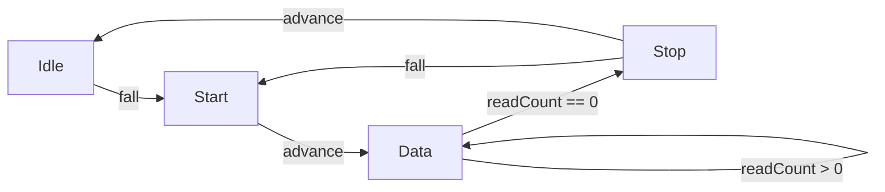
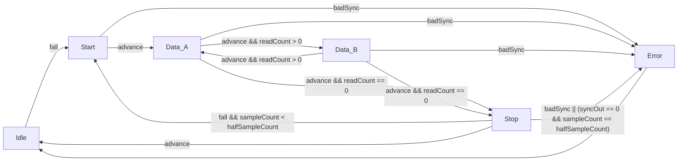

# UART Receiver

The PurdNyUart receiver is a finite state machine that implements an 8-N-1 UART
protocol with some synchronization and error detection features.

## Contents
* [Parameters](#parameters)
* [Inputs](#inputs)
* [Outputs](#outputs)
* [Functionality](#functionality)
  * [Basics](#basics)
  * [Constants](#constants)
  * [Control Signals](#control-signals)

## Parameters
|      Name      | Default |               Description                 |
|      :--:      | :-----: |               :---------:                 |
| `Oversample`   |    16   | The multiplier applied to the input `clk` |

## Inputs
|    Name    |  Width  |                 Description                   |
|    :--:    |  :---:  |                 :---------:                   |
|   `clk`    |    1    | Input clock                                   |
|   `nReset` |    1    | Asynchronous active-low reset                 |
|   `in`     |    1    | Asynchronous input signal                     |

## Outputs

|    Name    |  Width  |                 Description                   |
|    :--:    |  :---:  |                 :---------:                   |
|   `data`   |    8    | Received byte                                 |
|   `done`   |    1    | Byte read complete, `data` updated            |
|   `err`    |    1    | Read error occurred                           |

## Functionality

### Basics

The UART receiver state machine has the following high-level design:

#### States
  * **Idle**: a standby state, advances to start on a falling edge in the input
    signal
  * **Start**: start bit handler
  * **Data**: reads 8 bits of data into a shift register, signals done and
    switches to the Stop state upon completion
  * **Stop**: stop bit handler, if a falling edge is detected returns to the
    Start state, otherwise returns to Idle.

### Constants

The important constants are as follows:

|       Name        |         Value          |              Description              |
|       :--:        |         :---:          |              :---------:              |
| `fullSampleCount` | `Oversample - 1`       | Total number of samples in a state    |
| `fullSampleCount` | `(Oversample / 2) - 1` | Half the number of samples in a state |

### Control Signals

The important control signals are as follows:

|     Name      |           Value          |                    Description                   |
|     :--:      |           :---:          |                    :---------:                   |
| `edgeDetect`  |      `fall \|\| rise`    | An edge transition occurred in input             |
| `edgeCmp`     |        Set by FSM        | An edge transition previously occurred in current state |
| `sampleCount` |        Set by FSM        | Number of samples remaining in current state     |
| `readCount`   |  Set by FSM  | Number of bits left to read in current state (**Data** only) |
| `badSync`     | `edgeDetect && edgeCmp && (sampleCount >= halfSampleCount)` | Synchronization error  |
| `reSync`      | `edgeDetect && (sampleCount < halfSampleCount)` | Synchronization correction |
| `advance`     | `reSync \|\| (sampleCount == 0)` | Advance to next state                    |

### Complete FSM Diagram

### Typical Read Cycle
